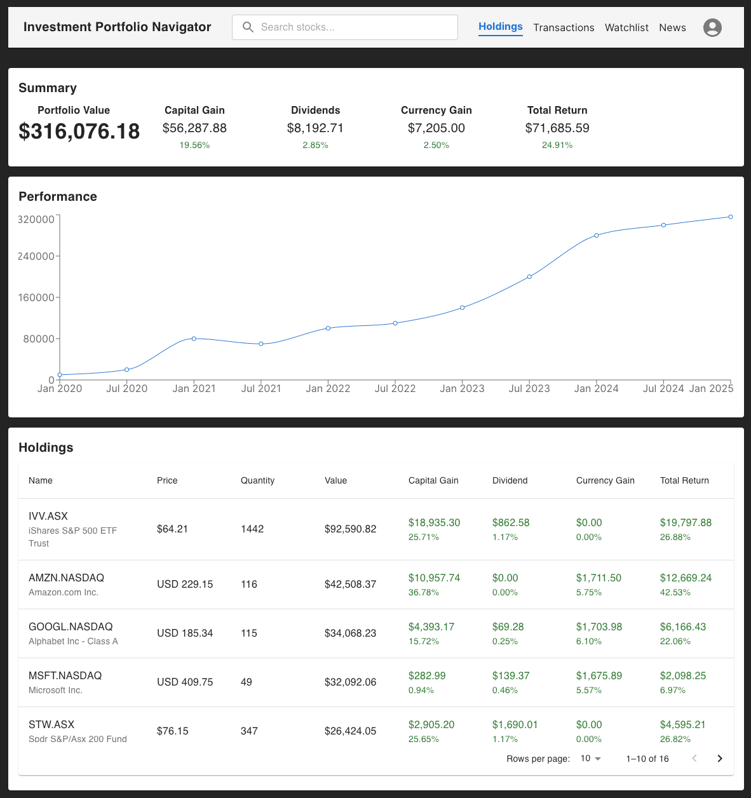
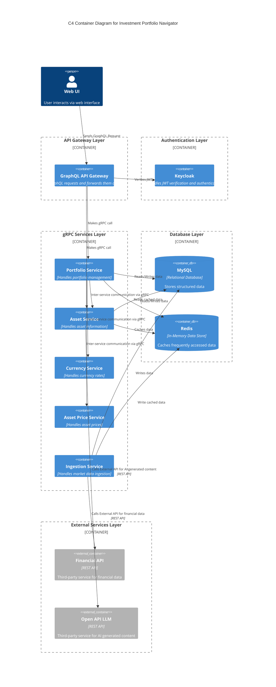
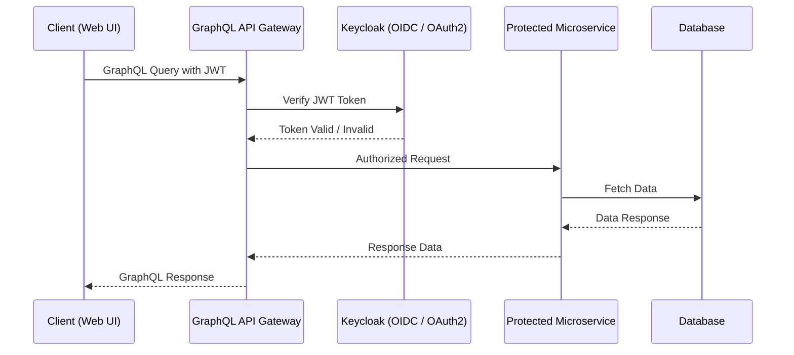

# Investment Portfolio Navigator

> Initial web ui (last updated on 17 Feb 2025)

## Project Description
The `Investment Portfolio Navigator` is a `side coding project` aimed at providing individual investors or traders a way to 
efficiently monitor their stocks' performance. This project uses the Go programming language  its development, ensuring 
a robust, scalable, and efficient solution.

The primary goal of this program is to allow users to track the performance of their individual stocks and their entire 
portfolio over time. It achieves these by sourcing real-time or historical data from reputable financial market data providers.

Here are the features it offers:

1. __Data Sourcing__: Ingest financial data, the Data Sourcing component is a crucial part of the Stock Portfolio 
Performance Tracker project. This component is responsible for fetching real-time and historical stock data from various 
trusted financial market data sources. It manages the efficient retrieval, processing, and storing of market data.

2. __Portfolio Creation__: Create multiple portfolios, each with a different set of stocks. The users can manage their 
portfolios easily by adding or removing stocks as and when needed.

3. __Performance Monitoring__: Real-time monitoring of the performance of each stock in the portfolio using live stock 
market data. Check the gains, losses, and total worth of your stocks at a glance.

4. __Historical Data Analysis__: It fetches historical data of stocks to allow users to analyze the past performance. 
This aids in conducting a comprehensive analysis to make well-informed investment decisions for the future.

5. __Risk Assessment__: Based on historical data and some predetermined algorithms, the software can estimate the risk 
factor associated with each stock, which helps users manage their investments better.

6. __Notifications & Alerts__: Users may set up alerts for certain stocks when they reach specified values, enabling them to
react quickly to market changes.

7. __Reports and Graphs__: Users can generate reports and charts to visualize the performance of their portfolio, making
data analysis handy.

8. __AI Generated Content__ : AI can generate concise summaries of the latest news and perform sentiment analysis to 
provide insights into a company's public perception.

The backed runs on Golang which ensures a seamless development experience, and it can be used on any operating 
system. I developed this on macOS Sonoma environment.

Please note that for this coding project, a good understanding of finance market concepts and Go language is required. 
The data fetched by this project is strictly for informational purposes and should not be taken as investment advice.

>### Note: This project began on January 25, 2025, and is currently in the development phase. As a result, some of the features mentioned above have not yet been fully implemented.

## High Level Architecture
Below is a high level architecture diagram for this project.

__Web Interface__: This is the entry point in the flowchart. It is a user interface, typically a website or a web 
application, where users send requests.

__GraphQL API Gateway__: This is the central node that routes incoming GraphQL requests to the appropriate gRPC services. 
This architecture effectively decouples the frontend from backend services and enables a unified way of accessing various 
services via GraphQL.

__Authentication service__: This is responsible for verifying the identity of users, applications, or systems before 
granting access to resources. It ensures that only authorized entities can interact with the system, protecting sensitive
data and functionality.

__gRPC Services__: They represent microservices that GraphQL API Gateway communicates with. The great thing about gRPC is 
that it uses Protocol Buffers (protobuf) which make it very efficient and scalable, ideal for microservices communication.

__Databases__: They manage both permanent and temporary data storage, ensuring efficient retrieval, organization, and 
persistence.

__External Services__ : They represent third-party services, external APIs, and other systems outside the application’s 
core infrastructure. 

## Authentication and Authorization 
For this project, I'll be using Keycloak as Auth provider.

## Tech Stack
### Backend
- Golang <https://go.dev/>
- gRPC, protobuf <https://grpc.io/>
- go-micro <https://github.com/micro/go-micro>
- graphQL <https://github.com/99designs/gqlgen>
- mySQL database <https://www.mysql.com/>
- Golang Migrate <https://github.com/golang-migrate/migrate/blob/master/GETTING_STARTED.md>
- Redis <https://redis.io/>
- NATS <https://nats.io/>
- OpenAI API <https://platform.openai.com/docs/overview>
- OpenID Connect <https://openid.net/developers/how-connect-works/>
- Keycloak <https://www.keycloak.org/>

### Frontend
- React.js <https://react.dev/>
- Vite <https://vite.dev/>
- Apollo Client <https://www.apollographql.com>
- Material-UI <https://mui.com/material-ui/>
- API Mocking for Javascript <https://mswjs.io/>

### DevOps
- Docker, Podman  <https://podman.io/>
- Kubernetes <https://kubernetes.io/>
- Minikube <https://minikube.sigs.k8s.io/docs/>
- Podman desktop <https://podman-desktop.io/>
- Helm <https://helm.sh/>
- Prometheus <https://prometheus.io/>
- Grafana <https://grafana.com/>
- Loki <https://grafana.com/oss/loki/>
- Hashicorp Vault <https://www.hashicorp.com/en/products/vault>

### Development Tools
- JetBrains Goland <https://www.jetbrains.com/go/>
- Datagrip <https://www.jetbrains.com/datagrip/>
- Jetbrains AI <https://www.jetbrains.com/ai/>
- ChatGPT <https://chatgpt.com/>
- Mermaid <https://github.com/mermaid-js/mermaid>
- Github Project Planning Tool <https://docs.github.com/en/issues/planning-and-tracking-with-projects/learning-about-projects/about-projects>

## References
- <https://go.dev/doc/tutorial/database-access>
- <https://github.com/go-sql-driver/mysql/>
- <https://site.financialmodelingprep.com/developer/docs>
- <https://community.veeam.com/kubernetes-korner-90/podman-desktop-and-minikube-a-great-combination-to-start-your-kubernetes-journey-6377>
- https://medium.com/@muppedaanvesh/a-hand-on-guide-to-vault-in-kubernetes-%EF%B8%8F-1daf73f331bd

