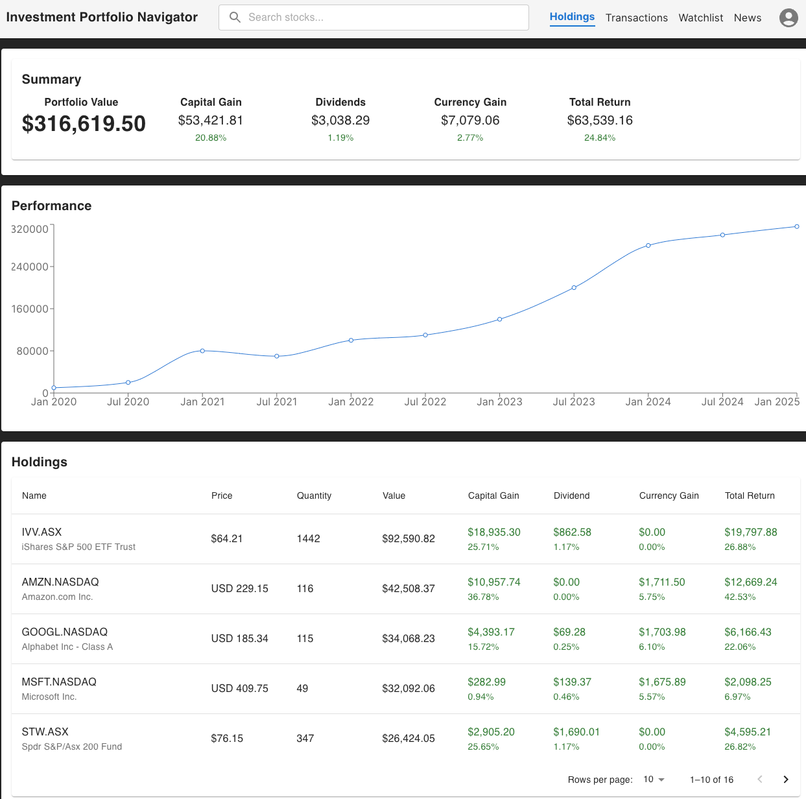

# Web application
The Web UI serves as the primary interface for users to interact with the `Investment Portfolio Navigator` application. 
It provides an intuitive, responsive, and visually appealing experience, allowing investors to monitor and manage their portfolios efficiently.

__Key Features & Responsibilities__:
- Dashboard & Portfolio Overview: Displays real-time portfolio performance, asset allocation, and key financial metrics.
- Interactive Charts & Graphs: Visualizes stock trends, portfolio returns, and market movements with dynamic charts.
- Transaction Management Interface: Allows users to add buy/sell transactions.
- Asset & Market Data Insights: Provides real-time and historical price data, company fundamentals, and news feeds.
- Transaction & Activity Log: Offers a detailed view of all transactions, dividends, fees, and corporate actions.
- Risk & Performance Analytics: Features tools for risk assessment, profit/loss tracking, and investment strategy evaluation.
- Customization & Personalization: Enables users to configure watchlists, alerts, themes, and display preferences.
- Multi-Device & Cross-Platform Support: Ensures a seamless experience across desktops, tablets, and mobile devices.
- Secure Authentication & User Management: Implements login, role-based access, and data security measures.

By integrating the Web UI , the stock portfolio management application enhances usability, accessibility, and engagement, 
helping investors make informed decisions and efficiently manage their investments.


## Create new project
```shell
npm create vite@latest atp-web -- --template react
cd atp-web
npm install
```

## GraphQL client
```js
import { ApolloClient, InMemoryCache, HttpLink } from '@apollo/client';

const client = new ApolloClient({
    uri: "/query",
    cache: new InMemoryCache(),
});

export default client;

```

```js
import { ApolloClient, InMemoryCache, ApolloProvider } from "@apollo/client";
import HoldingsSummary from "./components/HoldingsSummary";
import TopNavBar from "./components/TopNavBar";
import { BrowserRouter as Router, Routes, Route } from "react-router-dom";
import Transactions from "./components/Transactions";
import Watchlist from "./components/Watchlist";
import News from "./components/News";
import './App.css'
import client from "./services/apollo-client";

function App() {
    return (
        <ApolloProvider client={client}>
            <Router>
                <TopNavBar />
                <Routes>
                    <Route path="/" element={<HoldingsSummary />} />
                    <Route path="/holdings" element={<HoldingsSummary />} />
                    <Route path="/transactions" element={<Transactions />} />
                    <Route path="/watchlist" element={<Watchlist />} />
                    <Route path="/news" element={<News />} />
                </Routes>
            </Router>
        </ApolloProvider>
    );
}

export default App

```

## Setup Proxy in React Vite for CORS
When developing proof-of-concept applications on your local machine using Vite React, you may encounter CORS errors 
while attempting to integrate the front end, designed with React, and the backend API or GraphQL.

See the vite.config.js for configuration of the proxy.

```js
import { defineConfig } from 'vite'
import react from '@vitejs/plugin-react'

// https://vite.dev/config/
export default defineConfig({
  plugins: [react()],
  server: {
    proxy: {
      // Target the GraphQL gateway
      '/query': {
        target: 'http://localhost:8080',
        changeOrigin: true,
        //rewrite: (path) => path.replace(/^\/api/, ''),

        configure: (proxy, options) => {
          proxy.on('error', (err, _req, _res) => {
            console.log('error', err);
          });
          proxy.on('proxyReq', (proxyReq, req, _res) => {
            console.log('Request sent to target:', req.method, req.url);
          });
          proxy.on('proxyRes', (proxyRes, req, _res) => {
            console.log('Response received from target:', proxyRes.statusCode, req.url);
          });
        },
      },
    },
  },
})
```

## Run the app
```shell
npm run dev
```

## Material UI
```shell
npm install @mui/material @emotion/react @emotion/styled
```

## Mock API with MSW
MSW (Mock Service Worker) is a library that simplifies the process of intercepting and mocking HTTP requests. 
It operates by intercepting network requests during runtime and responding to them according to the mock definitions 
you provide. 

Install msw dependency
```shell
npm install msw --save-dev
```

Use the following command to generate the `mockServiceWorker.js`
```shell
npx msw init public/
```

Run with mock data
```shell
npm run mock
```

## What it looks like
The initial screen, populated with mock data, appears as follows (Last updated on 10 Feb 2025).
> Please note that this is still in the early stages of development and will be updated as progress is made.


