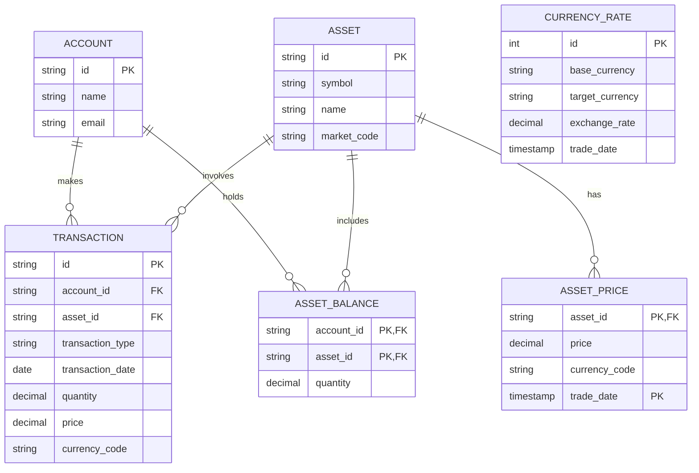

# DB migrations

## ER Diagram


## How to install golang-migrate
```shell
brew install golang-migrate
```

## How to install mySQL
```shell
podman  pull mysql:9.2
podman run -p 3306:3306 --name atp-db -e MYSQL_ROOT_PASSWORD=Pass123  -d mysql:9.2
podman exec -it atp-db bash
```

Check if running
```shell
podman ps 
podman port atp-db
```

## Create new database
```sql
CREATE DATABASE atp_db;
```

## db migrations in the minikube kubernetes cluster
To run db migrations in the minikube kubernetes cluster, replace the .env values
```shell
make migrate_up
```


## References
- https://www.freecodecamp.org/news/database-migration-golang-migrate/