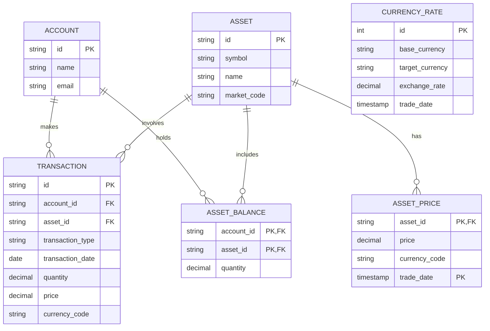

# DB migration
The DB Migration is responsible for managing database schema changes, ensuring data consistency, and 
facilitating seamless upgrades in `Investment Portfolio Navigator` application. It enables smooth transitions when modifying 
database structures while preserving existing data integrity.

__Key Features & Responsibilities__:
- Schema Evolution Management: Handles version-controlled schema updates, additions, and modifications.
- Data Migration & Transformation: Moves and restructures data when upgrading database models.
- Rollback & Version Control: Provides rollback mechanisms to revert changes if issues arise.
- Automated Migration Execution: Ensures seamless deployment of database changes without manual intervention.
- Integrity & Consistency Checks: Validates data consistency before and after migrations.
- Multi-Environment Support: Facilitates database updates across development, staging, and production environments.
- Audit & Logging: Maintains a record of all migration activities for compliance and debugging.
- Compatibility Handling: Ensures backward compatibility to prevent disruptions in application functionality.
- Performance Optimization: Refactors database structures for efficiency and scalability.

By integrating the DB Migration Component, the `Investment Portfolio Navigator` application maintains a stable and scalable 
database structure, enabling continuous improvements and feature enhancements without compromising data reliability.


## ER Diagram


## How to install golang-migrate
```shell
brew install golang-migrate
```

## How to install mySQL
```shell
podman  pull mysql:9.2
podman run -p 3306:3306 --name atp-db -e MYSQL_ROOT_PASSWORD=Pass123  -d mysql:9.2
podman exec -it atp-db bash
```

Check if running
```shell
podman ps 
podman port atp-db
```

## Create new database
```sql
CREATE DATABASE atp_db;
```

## db migrations in the minikube kubernetes cluster
To run db migrations in the minikube kubernetes cluster, replace the .env values
```shell
make migrate_up
```


## References
- https://www.freecodecamp.org/news/database-migration-golang-migrate/