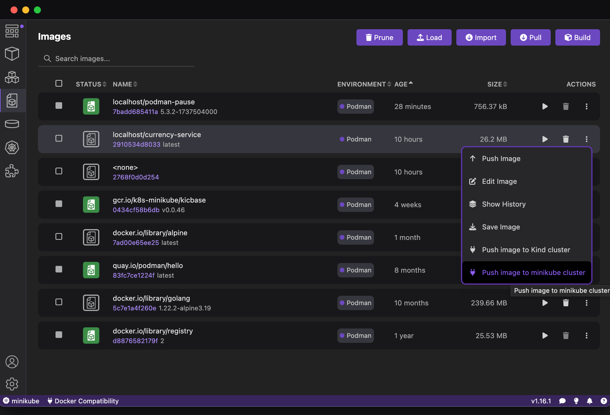
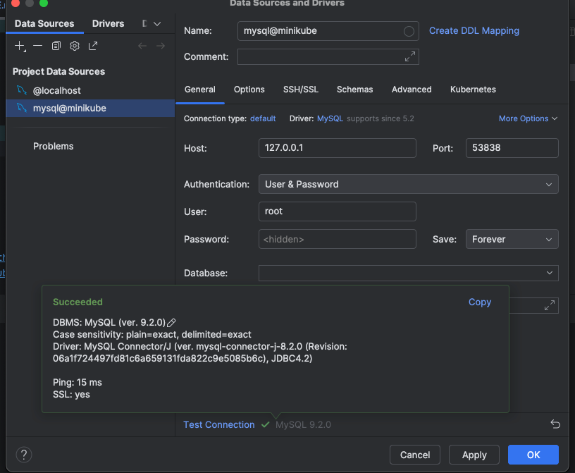

# Deployment


## Push image to minikube
Open podman desktop and push image to minikube.


```shell
minikube image tag docker.io/library/mysql:9.2 mysql:9.2 &&  minikube image push mysql:9.2
```

## Helm commands
### Mysql
```shell
cd mysql
helm install  mysql . --dry-run
helm install  mysql . 
helm ls
helm uninstall  mysql
```


### Currency Service
```shell
cd currency-service
helm uninstall  currency-service 
helm install  currency-service . --dry-run
helm install  currency-service . 
helm ls
```

```shell
minikube image tag localhost/currency-service:latest localhost/currency-service:1.0
minikube image push localhost/currency-service:1.0 
minikube image list
```


## NodePort
```shell
kubectl get svc

minikube service mysql-node --url
http://127.0.0.1:53838
❗  Because you are using a Docker driver on darwin, the terminal needs to be open to run it.

```

Open connection through port 53838


## Execute a command in a pod
```shell
kubectl exec currency-service-7f58898b7d-lw4kk  -- /app/service.currency -processor=currencyRateIngestor 
```


## References
- https://siweheee.medium.com/deploy-your-programs-onto-minikube-with-docker-and-helm-a68097e8d545
- https://podman-desktop.io/docs/minikube/pushing-an-image-to-minikube
