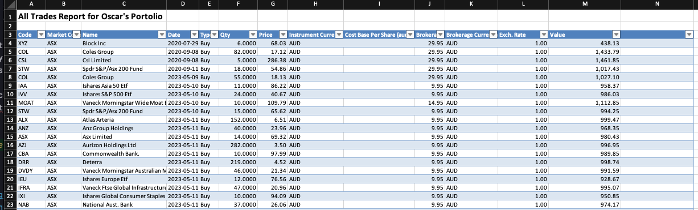
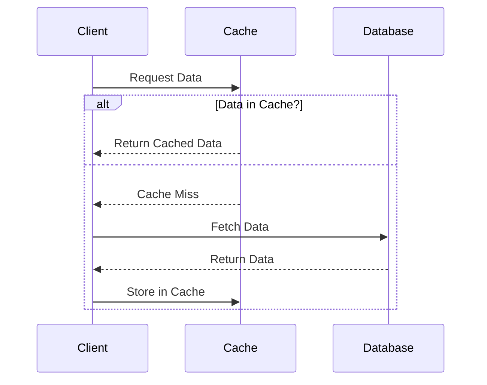
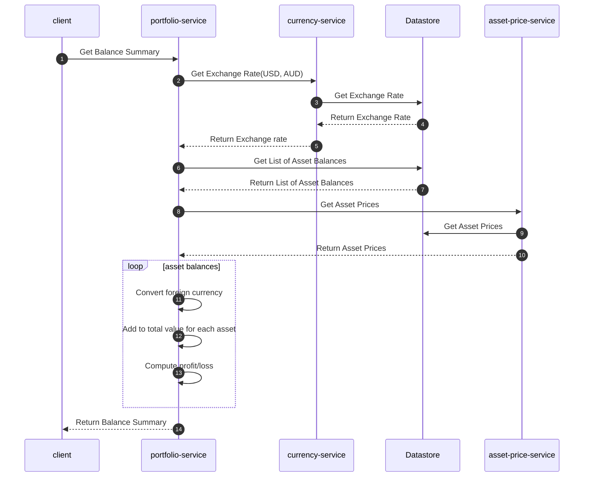

# Portfolio service
The Portfolio Service is a vital module in `Investment Portfolio Navigator` application that handles the recording, 
processing, and reconciliation of all financial transactions related to buying, selling, and managing assets. 
It ensures accurate tracking of investment activities and maintains a reliable transaction history.

__Key Features & Responsibilities__:
- Trade Management: Captures and records buy, sell, and other trade-related transactions.
- Transaction History Management: Maintains a detailed log of all past transactions for auditing and reporting.
- Asset Valuation: Computes the current market value of portfolio holdings based on the latest prices.
- Corporate Actions Processing: Adjusts prices based on stock splits, dividends, and other corporate actions.
- Multi-Currency Support: Processes transactions in different currencies with automatic conversion using real-time exchange rates.
- Fees & Tax Calculations: Tracks brokerage fees, commissions, and applicable taxes for accurate cost analysis.
- Portfolio Impact Analysis: Updates portfolio holdings, cash balances, and valuations after each transaction.


By incorporating the Portfolio Service, the `Investment Portfolio Navigator`  application ensures accurate, transparent, 
and efficient handling of investment activities, helping users maintain precise financial records and optimize their 
portfolio management strategies.


## Transaction Ingestor
This program is ingesting data from Excel file with the following format:




## Processing excel file 
```shell
go get github.com/xuri/excelize/v2
```

## Install mysql driver package
```shell
go get -u github.com/go-sql-driver/mysql
```

## Install go-cache
```shell
go get github.com/patrickmn/go-cache
```

## Install transactor
```shell
go get github.com/Thiht/transactor
```

## Install my custom libraries
```shell
go get github.com/garcios/asset-trak-portfolio/lib@main 
```


Go-Micro V4
```shell
go get go-micro.dev/v4@latest
```


## Set env variables
```shell
export DBUSER=root
export DBPASS=Pass123
```

## Run the asset ingestor
```shell
go run cmd/main.go -processor=assetIngestor
```

## Run the transaction ingestor
```shell
go run cmd/main.go -processor=transactionIngestor
```

## Run the transaction service gRPC
```shell
go run cmd/main.go 
```

## Truncate data
```shell
make truncate
```

## Ingesting asset and transaction data
```shell
make ingest_transactions
```

## Cache-Aside pattern
The cache-aside pattern is a design pattern used to manage the cache in a system. In this pattern, the application is 
responsible for controlling the cache. The cache is purely a storage mechanism and does not have any other functionality, 
such as executing database queries.

Here's how the cache-aside strategy works in general:

- When the application needs to read data, it first requests that data from the cache.
- If the data is found in the cache (a cache hit), it's returned to the application.
- If the data is not found in the cache (a cache miss), the application retrieves the data from the primary store 
(like a database), and puts it into the cache for future reads. Then the application returns the data retrieved from 
the database.
- When the application updates data, it writes directly to the primary store, and invalidates the corresponding data in 
the cache, if it's available there. The cache entry is discarded or overwritten the next time the application requests 
the data (and it's not found in the cache).

The cache-aside pattern ensures the cache is always filled with the most commonly used data, optimized for read operations. 
However, one downside is that if there is a high volume of "cache miss" events, retrieving data from the primary store 
could significantly slow down the system.

This pattern can be a good fit for read-heavy applications, where cache hit rates are high and cache misses are 
relatively rare. It's commonly used in microservice architecture and distributed systems where minimization of interaction 
with the primary data store is critical for performance.

Remember to set a suitable cache expiring policy to avoid potential stale data in the cache. If the data in your primary
storage changes frequently but you have stale data in your cache, it could cause significant issues, including serving 
outdated data to your users.



## Sequence diagram for Balance Summary



## References
- https://www.kelche.co/blog/go/excel/
- https://blog.logrocket.com/how-to-implement-memory-caching-go/
- https://hazelcast.com/blog/a-hitchhikers-guide-to-caching-patterns/
- https://github.com/Thiht/transactor